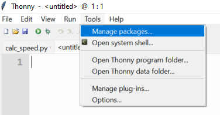
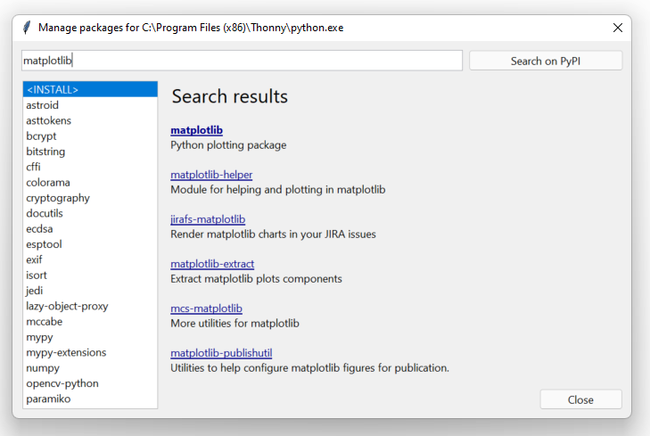
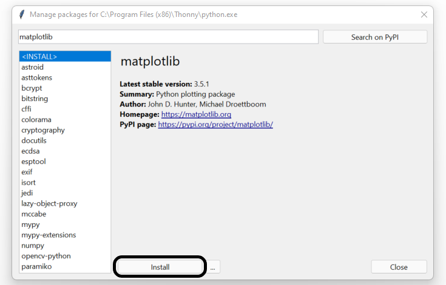
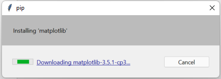

## Installing Python packages with Thonny

- Open Thonny from your application menu

- Click on **Tools** in the menu bar, and then select **Manage packages**

- Use the search box to find the package you are looking for.

- Select the package you want to install, then click on the **Install** button.

- A window will open showing the progress of your package install. Once completed the package will be available to use in your programs.

